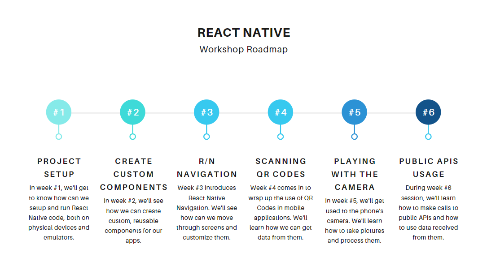
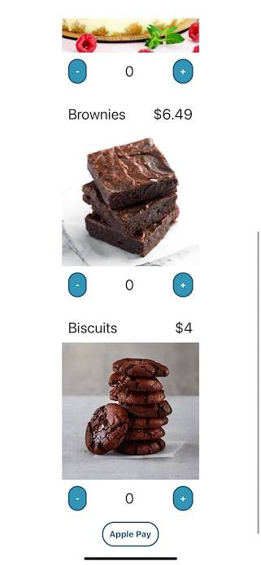

# UVT GDSC React Native Workshop
___
## What is this about?
Material taught at the React Native Workshop of Google Developer Students Club from West University of Timisoara.

Workshop Sessions Calendar: from November 7th to December 12th, once a week.
___
## Workshop Roadmap

___
## Session 1 - Project Setup
During this session, information such as how one initializes an application with Expo was taught.

Steps for project setup:
1. Download an IDE (Visual Studio Code, WebStorm ...)
2. Download Xcode / Android Studio for simulators / emulators
3. Download Node.js LTS.
4. Install expo-cli globally: `npm i -g expo-cli`
5. Initialize an application in the current directory: `expo init . --npm`
6. Run the application: `npm start`
7. Scan the QR code / run the app in a simulator / emulator

Basic React Native components such as `View`, `Text`, `Button`, `Image` were introduced.

___
## Session 2 - Create Custom Components
During the second session of the workshop, custom components were created. We saw in the first session that buttons on iOS are different from those on Android. If we want to have the same style for our app on both platforms, we should consider using custom components.

Custom components created in this session:
- `CustomButton` - for displaying a button, which can be filled or unfilled
- `Product` - for displaying a product, which has `title`, `price`, `imgUrl` and amount
- `PaymentModal` - for displaying a modal in which a summary of the order is displayed

